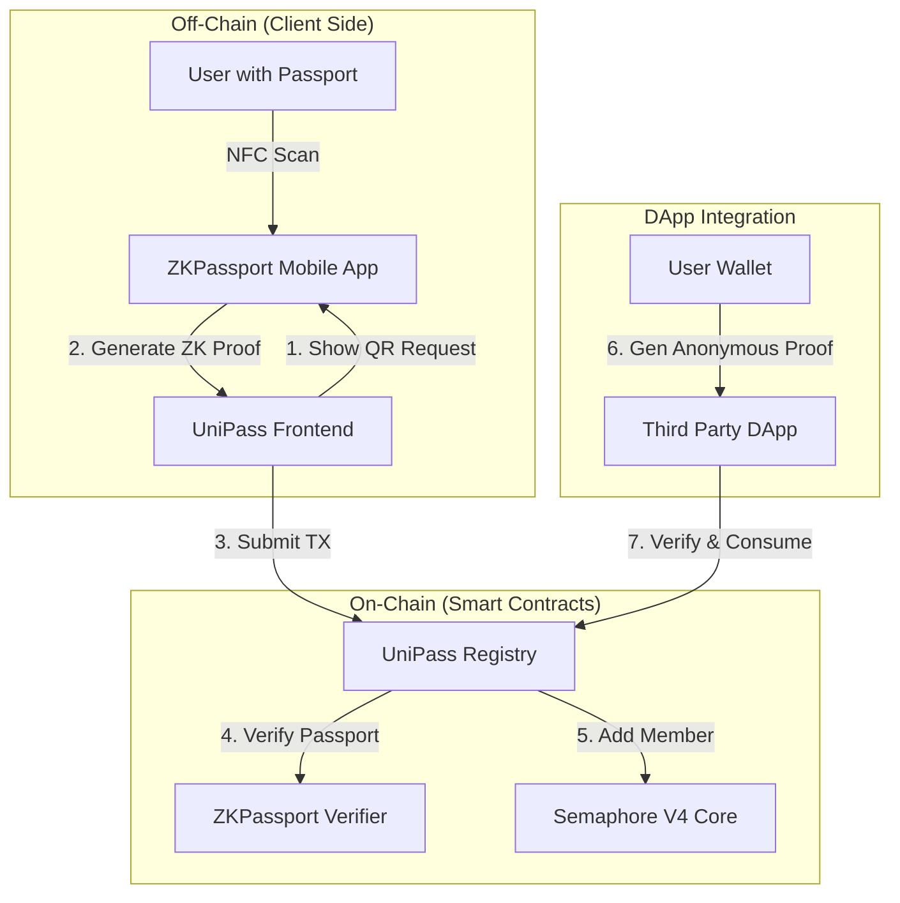

# UniPass

### —— 基于电子护照的全球通用匿名身份层 (Global Anonymous Identity Layer based on Electronic Passports)

**UniPass** 是一个去中心化的公共基础设施（Public Good），旨在解决 Web3 世界中“真人验证”与“隐私保护”之间的根本矛盾。它允许全球任何持有电子护照的用户，**仅需一次** 链下扫描验证，即可获得一个**永久有效、全球通用**的匿名真人身份。

---

## 🌟 核心价值 (Value Proposition)

*   **无需硬件 (Hardware-Free):** 只需要一本电子护照 (e-Passport) 和一部智能手机。不需要专用的虹膜扫描仪 (Worldcoin)。
*   **隐私优先 (Privacy-First):** 护照敏感数据（姓名、护照号、照片）**永远不上链**。链上仅存储零知识证明 (ZK-Proof) 和哈希承诺。
*   **防女巫攻击 (Sybil-Resistant):** 每一个护照只能注册一个身份。
*   **跨应用匿名 (Unlinkable):** DApp 只能验证你是“真人”，但无法追踪你的历史行为，也无法知道你是谁。

---

## 🏗 技术架构 (Architecture)

UniPass 结合了 **ZKPassport (信任层)** 和 **Semaphore V4 (隐私层)**。



### 核心组件

1.  **@zkpassport/sdk**: 负责生成二维码请求，连接移动端 App 读取护照 NFC 芯片，并生成证明（Proof of Valid Signature + Disclosed Attributes）。
2.  **Semaphore V4**: 用于维护匿名身份集合（Merkle Tree）。用户注册时加入 Group，使用时生成 Merkle Proof。
3.  **UniPassRegistry.sol**: 核心合约，协调 ZKPassport 的验证结果和 Semaphore 的成员管理。

---

## 📂 项目结构 (Project Structure)

这是一个 Monorepo，包含以下部分：

*   **`apps/web`**: Next.js 15 前端应用。
    *   集成 `@zkpassport/sdk` 生成扫描请求。
    *   集成 `@semaphore-protocol` 生成匿名交互证明。
*   **`packages/contracts`**: Solidity 智能合约 (Foundry)。
    *   包含 `UniPassRegistry` 和 `IZKPassportVerifier` 接口。
*   **`packages/sdk`**: TypeScript SDK。
    *   封装了复杂的证明生成和合约交互逻辑，供第三方 DApp 快速集成。

---

## 🚀 快速开始 (Getting Started)

### 前置要求

*   Node.js (v20+)
*   pnpm (v9+)
*   Foundry (Forge)
*   **ZKPassport App** (iOS/Android) - 用于扫描真实护照

### 安装

1.  **安装依赖**

```bash
pnpm install
```

2.  **编译合约**

```bash
cd packages/contracts
forge build
```

3.  **启动前端**

```bash
cd apps/web
pnpm dev
```

---

## 💻 使用流程 (User Journey)

### 1. 注册身份 (Setup Phase)
1.  打开 UniPass 前端。
2.  点击 "Start Verification"，屏幕显示二维码。
3.  使用 **ZKPassport App** 扫描二维码，并读取实体护照 NFC。
4.  手机端生成零知识证明 (Compressed EVM Proof)。
5.  前端接收证明，发起链上交易 `register()`。
6.  合约验证通过，将你的身份承诺 (Commitment) 加入全局匿名池。

### 2. DApp 验证 (Usage Phase)
1.  访问集成了 UniPass 的 DApp (如 Uniswap Airdrop)。
2.  DApp 请求验证 "Scope: Uniswap"。
3.  UniPass SDK 在本地生成 Semaphore 证明（无需再次扫描护照）。
4.  合约验证通过，执行业务逻辑（如发放空投），并标记该 Scope 下的 Nullifier 已使用。

---

## 🛠 SDK 示例 (For Developers)

```typescript
import { UniPassSDK } from "@unipass/sdk";

// 初始化 SDK
const sdk = new UniPassSDK({ 
  registryAddress: "0x...", 
  signer: walletSigner 
});

// --- 注册流程 ---

// 1. 获取注册请求 (生成二维码 URL)
const queryBuilder = await sdk.createRegistrationRequest();
// 展示 queryBuilder.url 给用户...

// 2. 收到 ZKPassport 证明后上链注册
// (identity 由 SDK 根据唯一标识符确定性生成)
await sdk.register(identity, proofResult);


// --- 验证流程 (DApp 端) ---

// 3. 用户在 DApp 中进行匿名验证
// verifyAndConsume 会验证用户在 Group 中，并消耗一次性的 Nullifier
await sdk.verifyAndConsume(
  identity, 
  group, 
  "Uniswap_Airdrop_Scope", // Scope
  "User_Wallet_Address"    // Signal
);
```

---

## 📄 许可证

MIT
