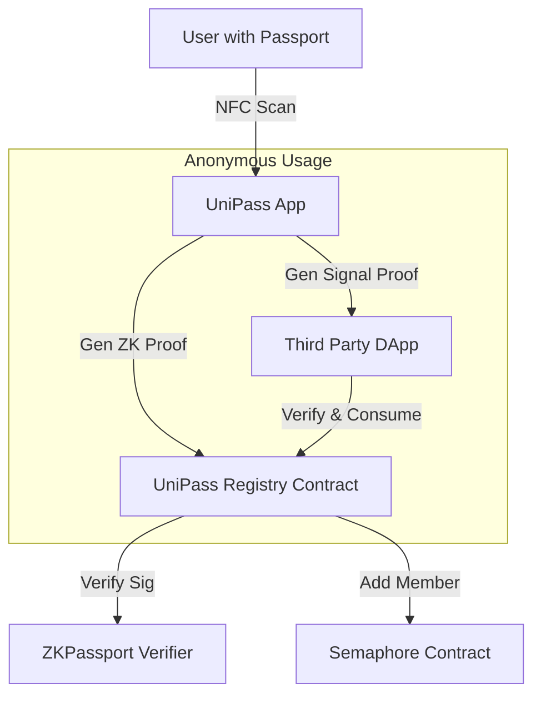

# UniPass (Based on Electronic Passport)

**UniPass** is a decentralized, anonymous identity layer that proves "Personhood" using ZK-proofs of real-world passports.

## 📂 Project Structure

This monorepo contains:

- **`apps/web`**: A Next.js 15 frontend for users to scan passports and manage their identity.
- **`packages/contracts`**: Solidity smart contracts (Foundry) for the Registry and Semaphore integration.
- **`packages/sdk`**: A TypeScript SDK for DApps to integrate UniPass verification.

## 🚀 Getting Started

### Prerequisites

- **Node.js** (v20+)
- **pnpm** (v9+)
- **Foundry** (Forge, Anvil, Cast)

### Installation

1. **Install Dependencies**

```bash
cd unipass-core
pnpm install
```

2. **Compile Contracts**

```bash
cd packages/contracts
forge build
```

3. **Run Frontend**

```bash
cd apps/web
pnpm dev
```

## 🏗 Architecture



## 🛠 Technical Details

- **Trust Source**: Electronic Passport (ICAO Standard) via ZKPassport.
- **Privacy Layer**: Semaphore V4 (Merkle Tree based Membership Proofs).
- **Sybil Resistance**: Each passport allows only **one** registration (tracked via Passport Nullifier).
- **Scope Isolation**: DApps use unique scopes/nullifiers, so they cannot track users across different applications.

## 📜 Key Contracts

- `UniPassRegistry.sol`: The main entry point.
  - `register(...)`: Verifies passport proof -> Adds to Semaphore Group.
  - `verifyAndConsume(...)`: Verifies anonymous membership -> Prevents double-spending in scope.

## 💻 SDK Usage

```typescript
import { UniPassSDK } from "@unipass/sdk";

const sdk = new UniPassSDK({ registryAddress: "0x...", signer });

// 1. Create Identity locally
const identity = await sdk.createIdentity();

// 2. Register (requires passport proof)
await sdk.register(identity, passportProof);

// 3. Verify in DApp
await sdk.verifyAndConsume(identity, group, "DApp_Scope_ID", "User_Address");
```

